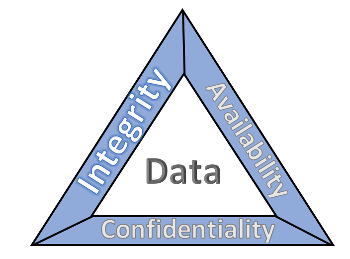

## The Three Guiding Principles

**Confidentiality** – Preserving authorized restrictions on information access and disclosure, including means for protecting personal privacy and proprietary information.

**Integrity** – Guarding against improper information modification or destruction and ensuring information non-repudiation and authenticity.

**Availability** – Ensuring timely and reliable access to and use of information.

https://www.nccoe.nist.gov/publication/1800-26/VolA/index.html

---

---